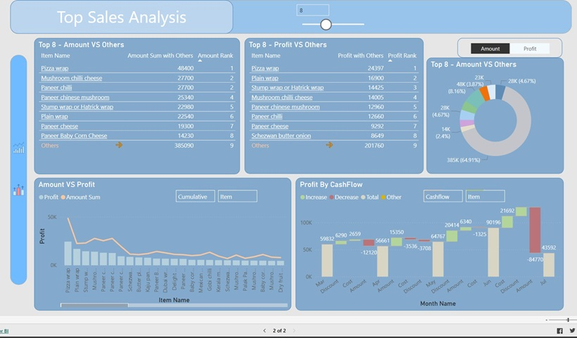
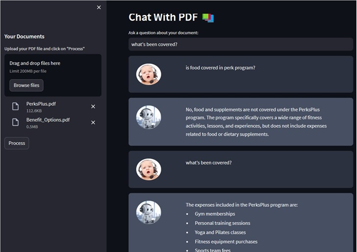

# Linglan Yang

# Technical Skills
- Data Engineer, Data Scientist, Data Analytics, Data Visualization
- Azure Synapse, Azure Data Factory, SQL Server, SSIS, SSRS, SSAS, Python, Power BI.

# Project instruction

### Peer-to-peer Lending Default Risk
The projct is to compare several classification models that can assist with predicting whether a client will default on their loan, 
the Classification approaches includes logistic regression, random forests, support vector machines and neural networks (Tensorflow). 
Please click [here](https://github.com/LingLanY/Machine-Learning/blob/main/Peer-to-peer%20Lending%20Default%20Risk.ipynb) to view the code.

### Power BI Demo Report
The report is to demo frequently asked reporting tricks such as popup filter panel, page navigation, highlight chart with max/min value, context calculation in hierarchy scopes, Top sales items VS Others, dynamic visual metrics; title; URL; font; icon, etc. To support these context calculation and user interactions, about 40 DAX measures are created with usage of 40+ different DAX functions such as Calculate, Rankx, Isinscope, Lookupvalue, Selectedvalue, Switch, Isonorafter, Removefilters, etc. Please click [here](https://app.powerbi.com/view?r=eyJrIjoiMmRmN2FmZDQtMzc2YS00MTExLTgyZTQtYzFkNWFkOTE3ZGQ1IiwidCI6IjA3ZWI2YmFlLWQ1MWEtNDBhYS1iZDMxLTIzMTE4NDdhM2I2ZiIsImMiOjJ9) to view the report.

### Chat with PDF 
Chatbot to read your own PDF file. Empower user to chat with their own data and capture insights from the documents efficiently by creating user’ own knowledge base and leveraging LLM’s language capability to allow user interact with the knowledge base. Python coding with Streamlit, Pypdf2, Langchain, Faiss-cpu, openAI.
Please click [here](https://github.com/LingLanY/AI) to access the gihub repository. <a href="Chat with PDF.pdf" download>Download project instruction</a>

